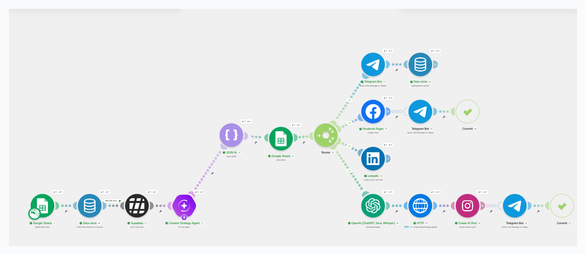
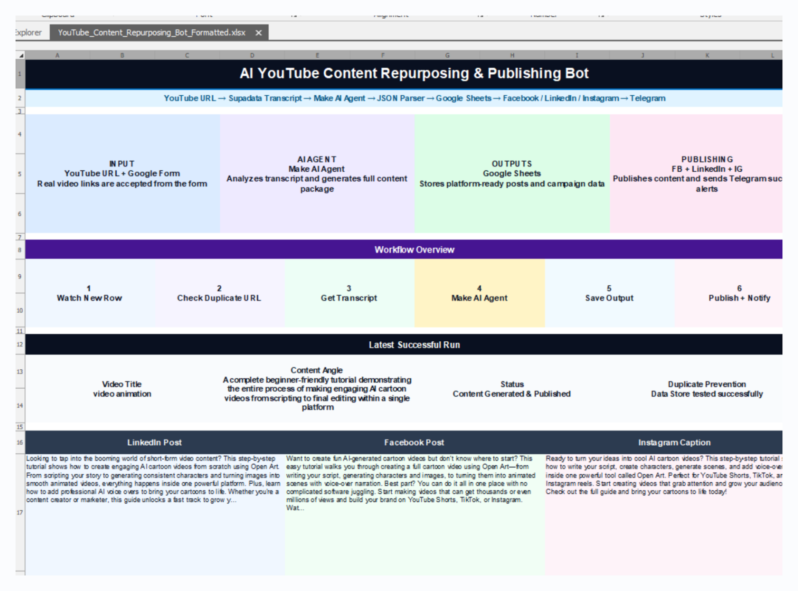
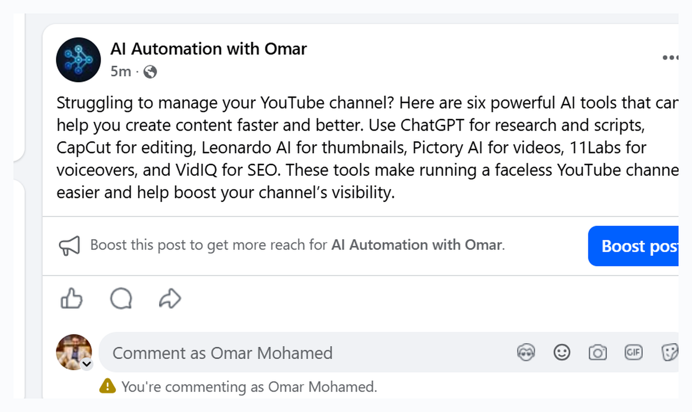
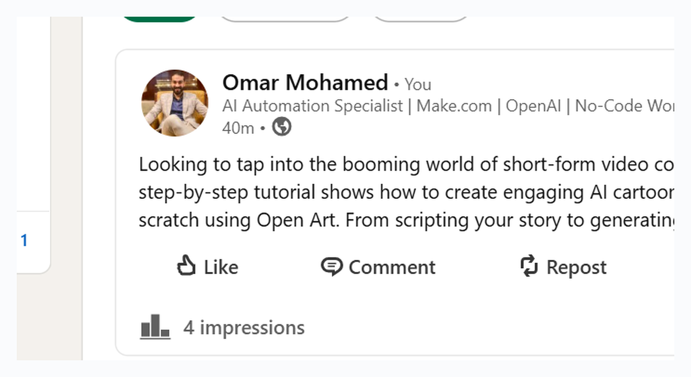

# AI YouTube Content Repurposing & Publishing Bot

An AI-powered Make.com automation workflow that accepts a real YouTube video URL, extracts the transcript, analyzes the content using a Make AI Agent, generates platform-specific social media content, saves the output to Google Sheets, and publishes the content to Facebook, LinkedIn, and Instagram.

---

## Project Overview

This project was built to help content creators, marketers, and businesses repurpose YouTube videos into ready-to-publish social media content automatically.

Instead of manually watching a YouTube video, writing posts, creating captions, generating images, and publishing across different platforms, this workflow automates the process from start to finish.

---

## Workflow

The workflow follows this process:

1. A new YouTube video URL is submitted through Google Forms / Google Sheets.
2. The workflow checks if the URL was processed before using Make Data Store.
3. Supadata extracts the transcript from the YouTube video.
4. A Make AI Agent analyzes the transcript and generates a full content package.
5. JSON Parser structures the AI output.
6. Google Sheets stores the generated content.
7. Router sends the content to different publishing branches.
8. The workflow publishes to Facebook, LinkedIn, and Instagram.
9. Telegram sends success notifications.
10. Error handlers log failed operations and send alerts.

---

## Scenario Overview

---

## Portfolio Dashboard

---

## Published Outputs

### Facebook Output

### Instagram Output

### LinkedIn Output

---

## Key Features

* Accepts real YouTube video URLs
* Extracts YouTube transcripts automatically using Supadata
* Uses Make AI Agent for content analysis and generation
* Generates platform-specific content
* Saves generated content to Google Sheets
* Publishes to Facebook Pages
* Publishes to LinkedIn
* Generates an AI image for Instagram
* Uploads the generated image using HTTP
* Publishes to Instagram for Business
* Sends Telegram success notifications
* Prevents duplicate processing using Make Data Store
* Includes error handling and alerting

---

## Tools Used

* Make.com
* Make AI Agent
* Google Forms
* Google Sheets
* Supadata
* JSON Parser
* Data Store
* OpenAI Image Generation
* HTTP
* Facebook Pages
* LinkedIn
* Instagram for Business
* Telegram Bot

---

## Use Case

This automation is useful for:

* YouTube content creators
* Social media managers
* Marketing agencies
* Coaches and consultants
* Personal brands
* Businesses that publish educational content
* Teams that want to repurpose long-form content into social content

---

## Business Value

This workflow helps reduce manual content repurposing work by automating:

* Transcript extraction
* Content analysis
* Social media copywriting
* Content organization
* Multi-platform publishing
* Notifications
* Duplicate prevention

It saves time, improves consistency, and helps businesses publish content faster across multiple platforms.

---

## Example Output

From one YouTube video, the workflow can generate:

* LinkedIn post
* Facebook post
* Instagram caption
* Short video hooks
* Twitter/X thread
* YouTube description
* Hashtags
* CTA
* Instagram image

---

## Version 1.0

Initial working version includes:

* Google Form / Google Sheets input
* YouTube URL processing
* Supadata transcript extraction
* Make AI Agent content generation
* Google Sheets output
* Telegram notification

---

## Version 1.1 Improvements

The workflow was improved with:

* Data Store duplicate prevention
* Facebook publishing
* LinkedIn publishing
* Instagram image generation and publishing
* Telegram success alerts
* Error handling routes

---

## Future Improvements

Possible future improvements:

* Draft-only / auto-publish mode
* Approval step before publishing
* Advanced publishing status tracking
* More platforms such as X/Twitter and TikTok
* Automatic thumbnail generation
* Notion content calendar integration
* Client-facing dashboard

---

## Status

Completed and tested successfully.

The workflow was tested with real YouTube URLs, generated content, saved results to Google Sheets, published posts to Facebook, LinkedIn, and Instagram, and sent Telegram notifications.

---

## Author

Omar Mohamed
AI Automation Specialist | Make.com | OpenAI | No-Code Workflows | Content Automation

